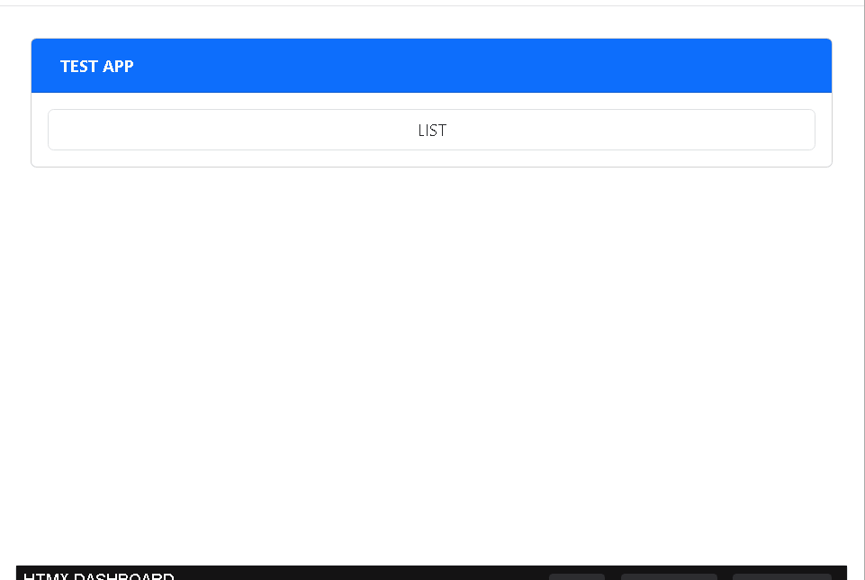
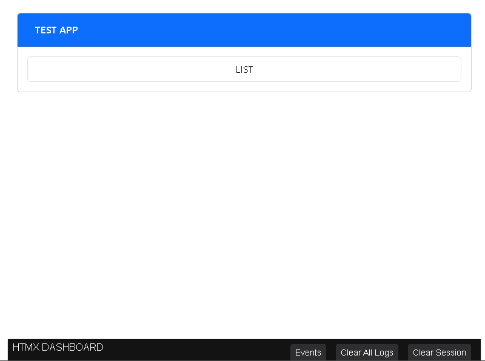
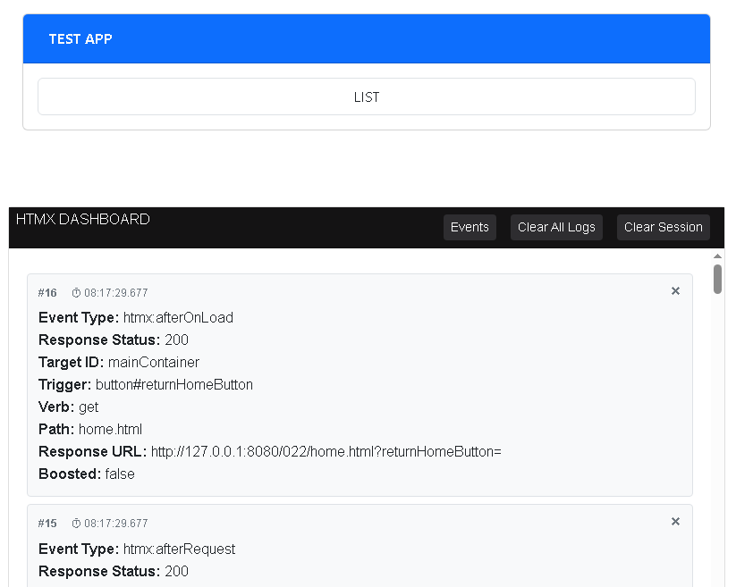
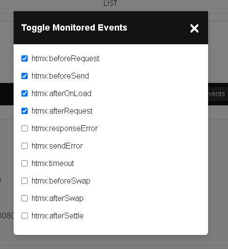
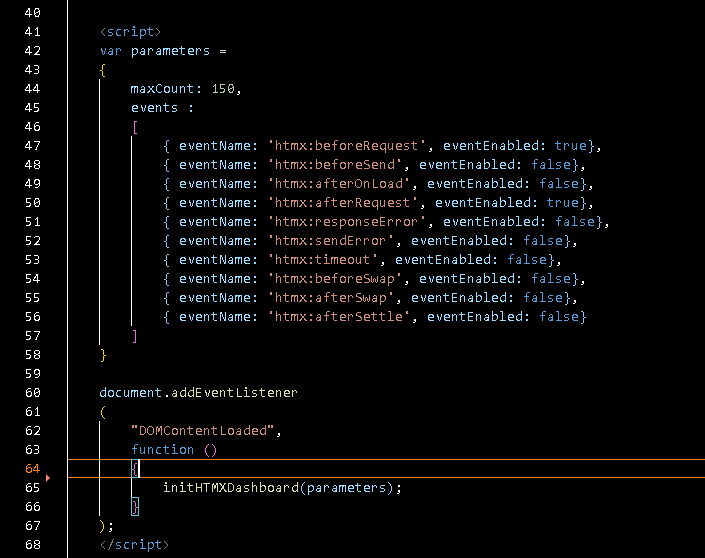

HTMX-Dashboard is a lightweight, vanilla JavaScript debugging widget for HTMX applications. 

It has zero dependencies, making it easy to drop into any project.

It has a non-intrusive UI, using a collapsible bottom dock and dedicated modal for toggling monitored events.

It uses state persistence with session storage to maintain enabled events across page reloads.

The events that are tracked can be changed by passing in a parameter that overrides the initial set.

Collapsed panel. 

Open panel. 

Event picker. 

Initialization. 
